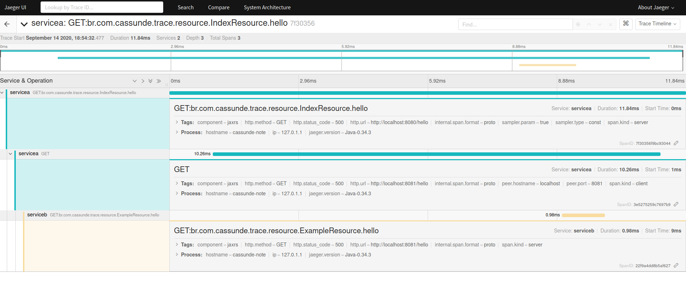

## Quarkus

Esse projeto implementa a solução usando as seguintes tecnologias:

- [Jaeger](https://www.jaegertracing.io/)
- [Smallrye Open Tracing](https://github.com/smallrye/smallrye-opentracing)

## Testando

- Levante Jarger

> docker run -p 5775:5775/udp -p 6831:6831/udp -p 6832:6832/udp -p 5778:5778 -p 16686:16686 -p 14268:14268 jaegertracing/all-in-one:latest

- Start os projetos quarkus com o comando abaixo em cada projeto

> ./mvnw quarkus:dev

- Chame a seguinte URL usando GET

> http://localhost:8080/

URL acima irá logar e chamar o segundo serviço que está rodando na porta 8081

Após executar e receber o retorno mais ou menos assim

```json
{
  "Exemplo1",
  "Exemplo2"
}
```

Quando acessarmos o endereço do Jaeger http://localhost:16686/ conseguiremos visualizar os serviços da seguinte forma:



