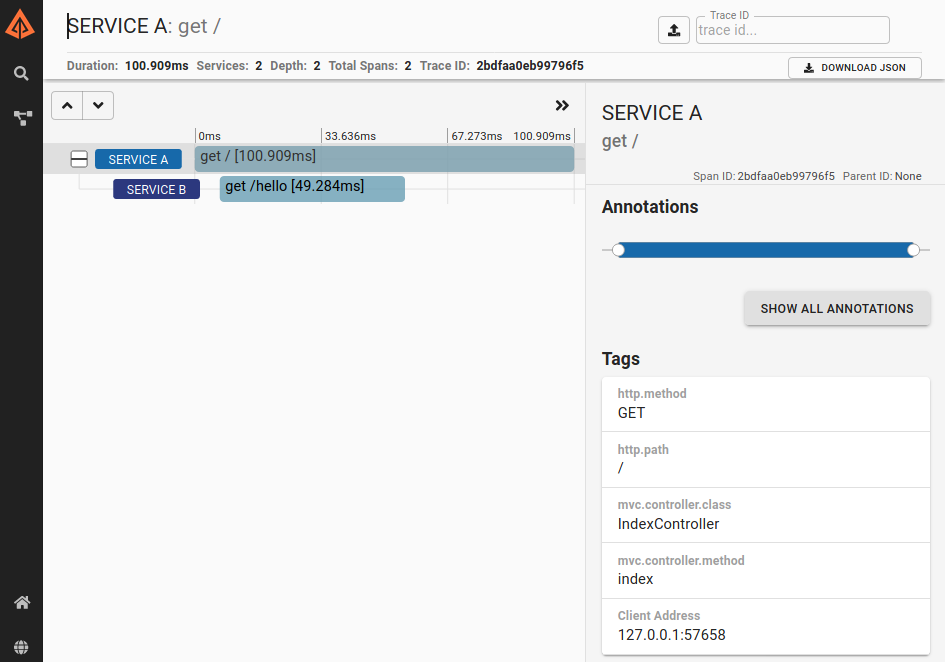

## Spring-Boot

Esse projeto implementa a solução usando as seguintes tecnologias:

- [Zipkin](https://zipkin.io/)
- [Sleuth](https://spring.io/projects/spring-cloud-sleuth)

## Testando

- Levante Zipkin

> docker run -itd --name trace -p 9411:9411 openzipkin/zipkin

- Start os projetos spring-boot com o comando abaixo em cada projeto

> ./mvnw spring-boot:run

- Chame a seguinte URL usando GET

> http://localhost:8080/

URL acima irá logar e chamar o segundo serviço que está rodando na porta 8081

Após executar e receber o retorno mais ou menos assim

```json
{
  "Exemplo1",
  "Exemplo2"
}
```

Quando acessarmos o endereço do Zipkin http://localhost:9411/zipkin/ conseguiremos visualizar os serviços da seguinte forma:

